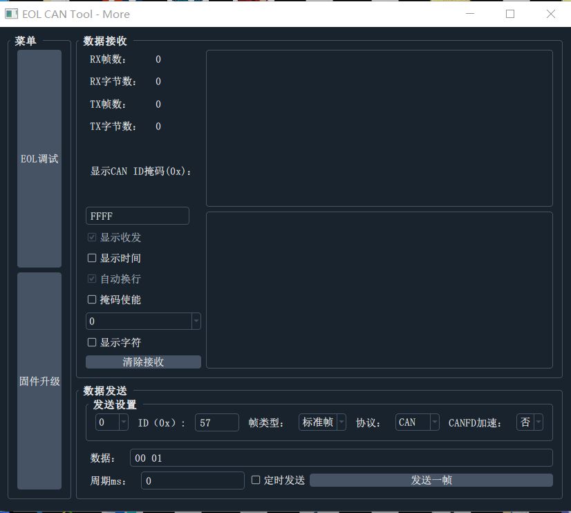
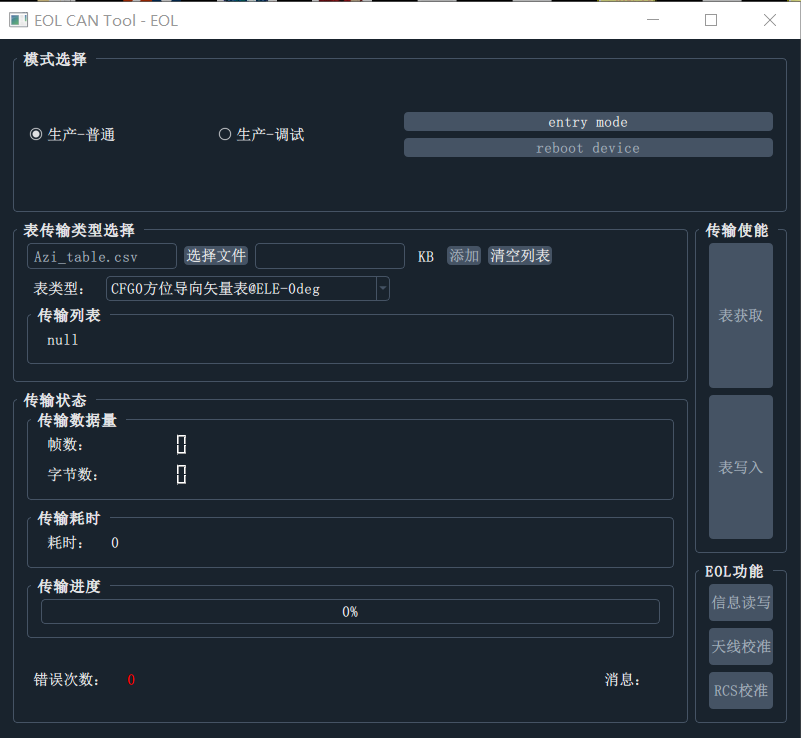
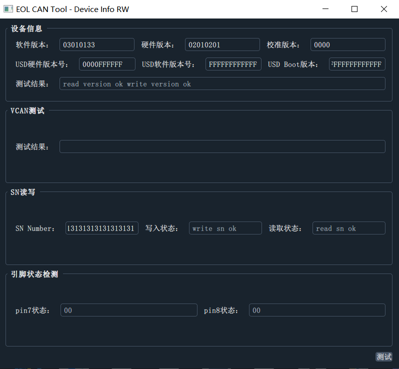
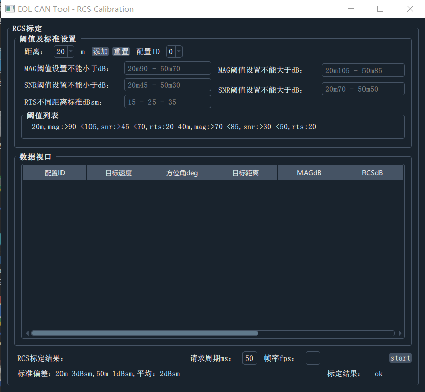
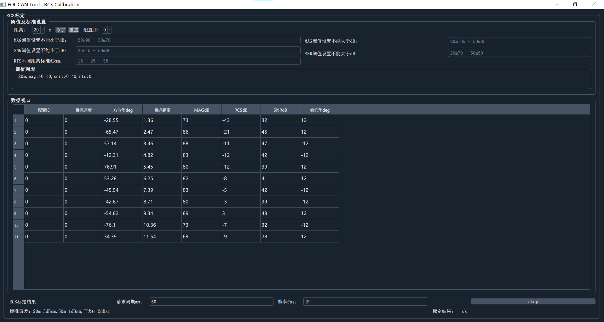

# EOL上位机功能

## 上位机界面

### 主界面

本页功能：

- 选择can设备，使能相应的通道，打开can数据通讯
- 进入下一级的按钮

需求功能：

- ~~目前只针对周立功can全面支持，需增加其他can设备的支持~~
- 支持更多的数据接入接口：网络、串口（可调试adc数据）

## 更多

本页的功能：

- 支持两个通道显示数据的收发
- 支持掩码配置
- 支持将接收的数据转为字符串输出
- 手动发送报文
- 报文收发双色显示，带时间戳
- 提供进入其他菜单的按钮

需求功能：

- 通道显示窗口可灵活扩展
- 升级功能支持
- 手动发送窗口能够自动在数值尾部添加计算常用的crc值，点击一下相应的crc按钮，自动计算数据crc数值，追加在数据尾部显示

## EOL调试页面

本页的功能：

- 提供进入或者退出EOL模式的按钮，重启设备按钮
- 提供各种类型表的写入与读取，以及相应的进度显示
- 提供报文传输返回值显示
- 提供进入EOL模式后的信息读写测试页面、天线校准页面、rcs校准页面

需求功能：

- 需要增加进入调试页面的按钮

## 信息读写页面

本页功能：

- 实现版本、SN、mounID读写测试

需求功能：

- 需要读写分开，当前是读出后再以相同的值写入，通过返回值判断是否写入成功，需要改为，单独读出，可修改后再写入
- VCAN测试暂时未加入，需要加入

 ## 天线校准页面

本页功能：

- 设置目标模拟器rts的相关参数
- 设置转台水平转动相关参数
- 设置转台上下抬头相关参数
- 模拟发送转台信息给雷达，请求2DFFT数据
- 生成2DFFT数据csv

需求功能：

- 增加ini解析，可以导出导入配置
- 接入转台以及rts控制协议，联动转台以及模拟器

## RCS标定页面

本页功能：

- 设定阈值
- 持续获取目标数据

需要功能：

- 当前阈值与获取目标信息已经完成，需要增加对对目标rcs标定的过程，并给出一个结果

- 需要联动rts，将目标模拟值设置到rts中去

## 新增调试页面

- 支持调试协议的设定内容，并联动rts以及转台
- 支持modbusTCP协议控制转台
- 支持TCP/IP协议控制RTS

## 新增更新功能

