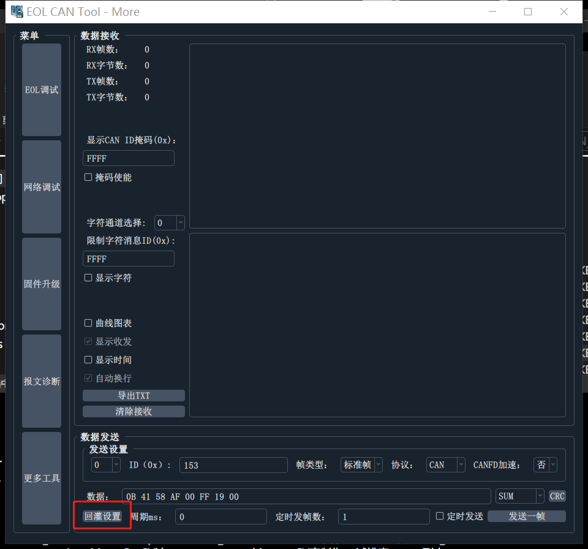
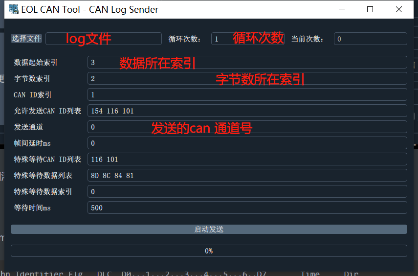
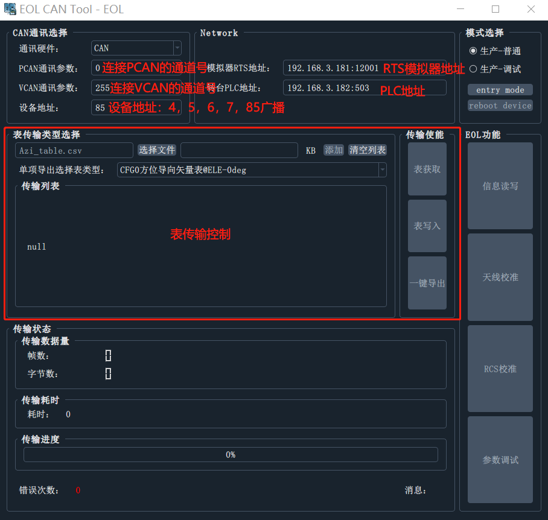
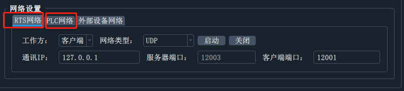
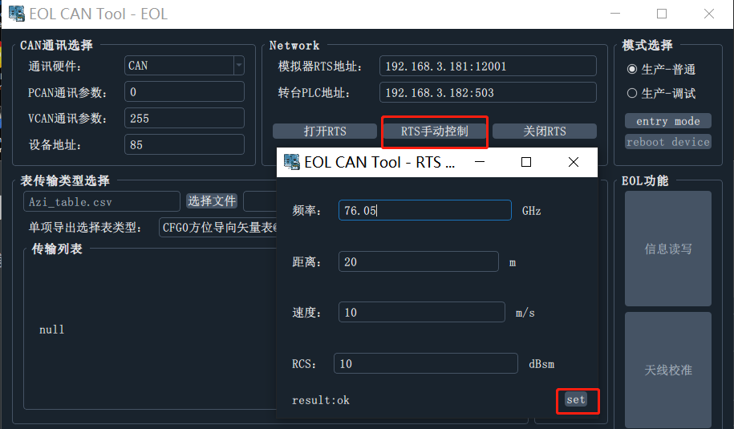
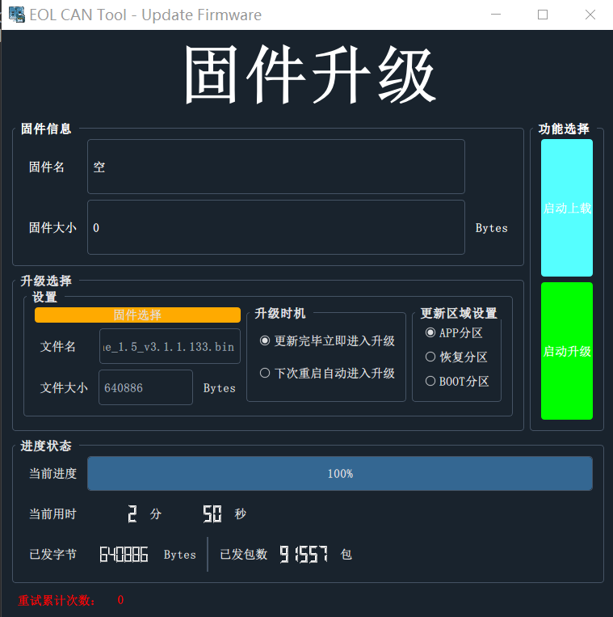
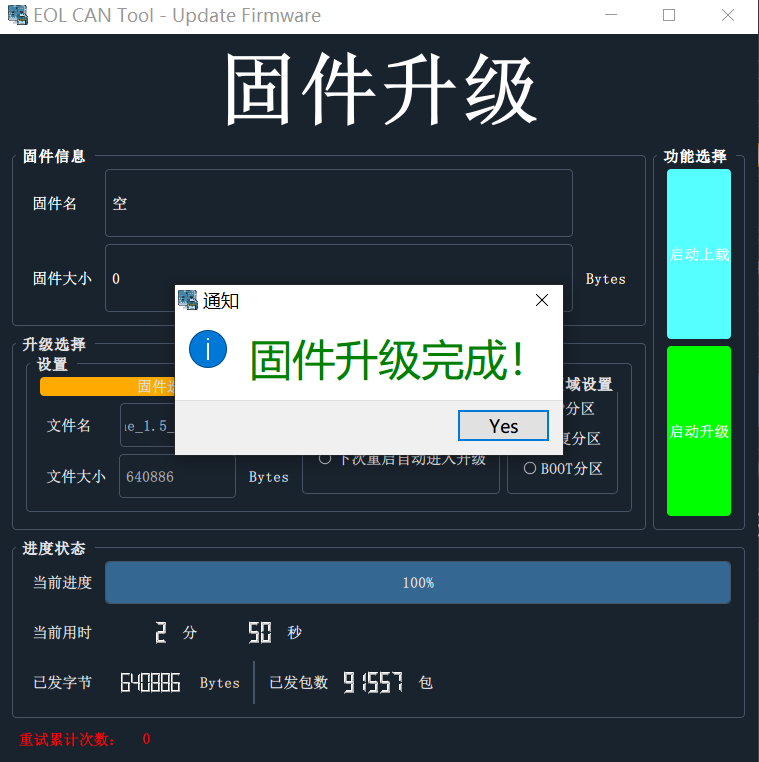
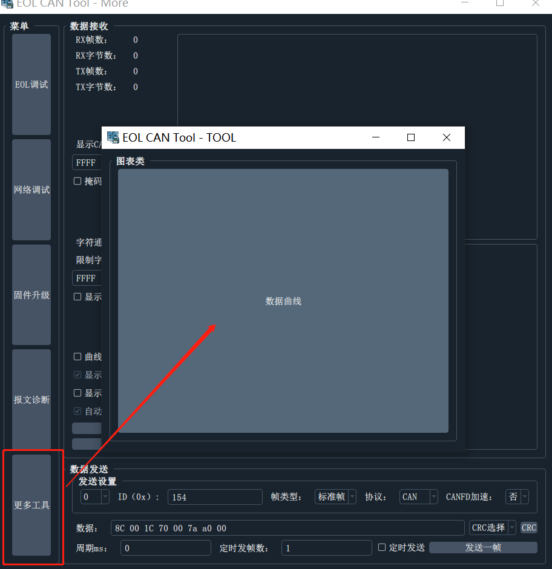
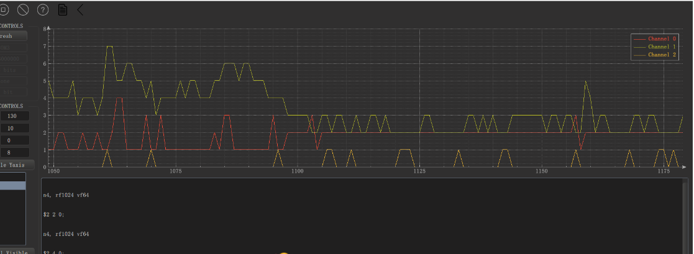
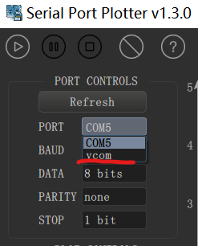

# EOL_CAN_Tool上位机说明

| 日期      | 修订内容                      | 版本   | 修订人 |
| --------- | ----------------------------- | ------ | ------ |
| 2023.12.1 | 初版                          | v0.0.1 | Aron   |
| 2024.1.29 | 更新软件更新说明，EOL协议说明 | v0.0.2 | Aron   |
| 2024.2.26 | 增加固件升级说明              | v0.0.3 | Aron   |
| 2024.3.20 | 增加can数据回灌功能说明       | v0.0.4 | Aron   |
|           |                               |        |        |

[toc]

## 上位机功能

- 多品牌厂商can设备支持
  - 周立功全系
  - 广成 can / canfd
  - 同星
  - kvaser全系

- CAN数据通讯测试
  - 报文转换（将指定CANID报文 CANFD->CAN 或是 CAN->CANFD）
  - 队列定时发送
  - 队列定次发送
  - 手动发送
  - 报文周期监控统计
  - 数据回灌功能
- CAN串口调试功能
  - 将串口数据转为ascii形式显示，与串口工具类似
- RTS控制功能（UDP网络）
  - 设置中心频率
  - 设置带宽
  - 设置距离
  - 设置速度
  - 设置rcs
- PLC控制功能（Modbus TCP），即将支持....
- shell交互功能
  - 查看软件版本、SN
  - 设置/读取雷达内部运行参数
  - 雷达重启
  - 查看方向图
  - 依据雷达软件任意扩展功能，等等...
- EOL全功能
  - 获取2D数据
  - 目标刷新显示
  - DBF校准数据写入读取
  - 雷达版本SN信息读写
- 网络调试功能
  - UDP
  - TCP
- 固件升级
- 曲线图表功能
  - 支持来自can / 网络 / 串口数据的曲线绘制（用于程序运行时间监控、变量数值监控）
- 软件更新

## 上位机界面


## EOL相关使用说明

### CAN设备连接

#### 选择设备

can设备连接好电脑后，依次选择`品牌`->`设备型号`->`通道`（选择打开第几个通道或者全部打开，编号从0开始）

**设备索引**是用于区分，多个同型号can设备连接到电脑

**设备信息**是用于读取设备的SN，通道数等信息，当可读时点击将弹窗显示


#### 设置通讯参数


#### 启动连接

依次点击：打开，初始化，启动


> 点击 更多则进入can通讯测试主页面，上方窗口将显示，设备是否打开启动成功


### CAN通讯测试


本页的功能：

- 支持两个以上通道数据的收发
- 支持掩码配置
- 支持将接收的数据转为字符串输出（可指定需转换can通道，指定需转换的canid）
- 手动发送报文
- 报文收发双色显示，带时间戳
- 提供进入其他菜单的按钮
- 手动发送窗口能够自动在数值尾部添加计算常用的crc值，点击一下相应的crc按钮，自动计算数据crc数值，追加在数据尾部显示

- 支持定时发送、定次发送（定时发送帧数不填则发送次数无限，周期最小为1ms即使写0）

- 曲线图表功能，勾选可将数据转发至图表曲线显示

#### 数据回灌功能



数据回灌功能需要设置回灌的数据数据格式，通常需要txt格式或者csv格式的文件



log demo

```csv
Chn Identifier Flg   DLC  D0...1...2...3...4...5...6..D7       Time     Dir
 1    00000116         8  A1  00  00  00  00  00  00  00   31066.395190 R
 1    00000216  FB     8  01  11  11  11  11  11  11  11   31066.571780 R
 1    00000154         8  8D  00  1C  70  00  00  0D  00   31067.082570 R
 1    00000254  FB     8  8D  00  00  00  00  00  00  00   31067.327670 R
 1    00000154         8  81  00  00  00  00  00  00  00   31067.327970 R
 1    00000254  FB     8  81  00  00  00  00  00  00  00   31067.329070 R
 1    00000154         8  07  84  AB  76  F0  75  D0  C8   31067.329330 R
 1    00000154         8  0F  10  26  4D  E8  80  CF  CD   31067.330650 R
 1    00000154         8  17  DA  50  B0  5A  6F  30  3C   31067.332660 R
 1    00000154         8  1F  F1  C2  30  E8  0D  F6  F0   31067.334650 R
 1    00000154         8  27  90  58  FA  50  98  D2  D0   31067.336650 R
 1    00000154         8  2F  F0  5E  A9  58  90  10  0D   31067.338670 R
 1    00000154         8  37  FB  F0  A6  6D  6D  B0  25   31067.340690 R
 1    00000154         8  3F  11  EA  00  DE  AE  11  A0   31067.342670 R
 1    00000154         8  47  46  1E  53  A0  7E  1F  A8   31067.344650 R
 1    00000154         8  4F  80  82  FF  91  D0  75  88   31067.346660 R
 1    00000154         8  57  CA  A0  2E  15  DD  A0  D1   31067.348650 R
 1    00000154         8  5F  F1  DD  B0  B4  FA  61  20   31067.350650 R
 1    00000154         8  67  30  C9  D9  50  D8  C1  E7   31067.352650 R
 1    00000154         8  6F  50  95  79  1B  D0  A6  9A   31067.354640 R
 1    00000154         8  77  91  90  4A  CD  9F  70  F5   31067.356650 R
 1    00000154         8  7F  89  FE  40  A0  D5  56  60   31067.358660 R
 1    00000154         8  07  0A  39  FE  50  0B  0A  01   31067.360650 R
 1    00000154         8  0F  E0  58  DA  8F  60  7F  C7   31067.362660 R
 1    00000154         8  17  E1  50  80  27  E7  D0  7F   31067.364660 R
 1    00000154         8  1F  0C  3E  40  64  F1  3A  C0   31067.366660 R
 1    00000154         8  27  19  55  F5  D0  9C  5A  BE   31067.368650 R
 1    00000154         8  2F  A0  5A  79  6A  30  1D  31   31067.370640 R
```

比如以上一段log数据，我们需要发送0x154、0x116的can id数据，那么我们需要设置：

- can id在空格分割每行字段后，can id所在索引应是：`1`
- 数据开始的索引应是：`3`
- 帧间间隔代表每发送完一帧需要等待的时间设置ms
- 特殊等待can id是指定特定的can id发送完成后等待时间（可以不进行设置）
- 特殊等待数据是指定遇到此数据等待特定时间ms（可以不进行设置）
- 特殊等待数据索引是指定，数据所在的index（可以不进行设置，默认为0）

### EOL调试页面



本页的功能：

- 提供进入或者退出EOL模式的按钮，重启设备按钮
- 提供各种类型表的写入与读取，以及相应的进度显示
- 提供报文传输返回值显示
- 提供进入EOL模式后的信息读写测试页面、天线校准页面、rcs校准页面
- 进入下级页面的按钮

### 信息读写页面


本页功能：

- 实现版本、SN、mounID读写测试
- DTC检测
- VCAN测试

### 天线校准页面获取2D数据


本页功能：

- 设置目标模拟器rts的相关参数
- 设置转台水平转动相关参数
- 设置转台上下抬头相关参数
- 模拟发送转台信息给雷达，请求2DFFT数据
- 生成2DFFT数据csv

> 添加配置按钮属于增量式添加，如果需要重新配置，则需要先清除配置
>
> 当只需要添加某一个方向的2D数据，将其他方向的条件置空即可不采用

### RCS标定看目标


本页功能：

- 设定阈值
- 持续获取目标数据
- 通过**刷新显示过滤**设置，筛选出指定条件的目标方便观测、统计
- 统计目标设置，将进一步过滤目标输出到统计列表中

> 前提条件：添加一个条件到阈值列表方可启动看目标

### SHELL调试

- shell调试支持控制台字体颜色切换
- 支持复制粘贴（复制后，使用鼠标右键粘贴）
- 支持`TAB`键补全命令
- 支持上下键查看历史命令
- 回车键执行命令


## 网络调试

当前网络调试提供了两个网络设备提供调试功能：RTS，PLC



### RTS网络

RTS使用UDP通讯，**发送与接收端口区分**，所以在客户端网络即PC端网络需启用两个一个监听用于接收RTS发出的消息，一个用于发送控制RTS

RTS网络需要设置两个端口：客户端端口（发送端口），服务器端口（接收端口）

通讯IP设置为本机的局域网IP地址（与RTS在同一子网）

工作方式设置为`客户端`

点击`启动`按钮，启动成功后即可在**更多->EOL调试页面**看到RTS的控制按钮



### PLC网络

## 固件升级



点击`固件选择`

- 选择bin文件

点击`启动升级`，复位雷达（**可进入EOL模式，点击重启设备，进行软复位**）

升级成功：



> 当升级过程中关闭页面，工具将退出升级流程

## 其他工具

### 曲线图表

> 曲线图表的功能进入



曲线图表要求输入方式为：$1 2 3;

- 以`$`开头
- 以`;`结尾
- 中间数字以`空格`隔开
- 1：代表通道0在当前时刻的数值
- 2：代表通道1在当前时刻的数值
- 3：代表通道2在当前时刻的数值

> C程序代码中可使用以下接口实现多通道数据的绘制显示：

```c
/**
 * @brief 格式化时间
 *
 * @param t 时间
 * @param ch 通道号
 * @param size 通道数
 */
void Show_Elapsed_Time(uint32_t t, uint32_t ch, uint32_t size)
{
  static char time_ms[64] = {0};
  if(1 == size)
  {
    EMBARC_PRINTF("$%u;\r\n", t);
  }
  else
  {
    if(ch == 0)
    {
      sprintf(time_ms, "$%u", t);
    }
    else
    {
      sprintf(time_ms + strlen(time_ms), " %u", t);
      if(ch == size - 1)
      {
        sprintf(time_ms + strlen(time_ms), ";\r\n");
        EMBARC_PRINTF(time_ms);
      }
    }
  }
}

/* 使用 */
uint32_t S = RTC_TO_MS(rtc_count());

track_read(bb->track);//需要测量的时间，通道0中显示

uint32_t E = RTC_TO_MS(rtc_count());
Show_Elapsed_Time(E - S, 0, 2);
S = RTC_TO_MS(rtc_count());

xxx();//需要测量的时间，通道1中显示

E = RTC_TO_MS(rtc_count());
Show_Elapsed_Time(E - S, 1, 2);
S = RTC_TO_MS(rtc_count());

xxx();//需要测量的时间，通道2中显示

E = RTC_TO_MS(rtc_count());
Show_Elapsed_Time(E - S, 2, 3);

```



#### 数据通道选择



- vcom代表虚拟通道，代表数据来自非串口设备（可通过勾选曲线图表，进行数据流转发）
- 非vcom代表数据使用串口

## 工具更新功能

> 当有新软件版本发布，软件在每次启动时将提醒更新


## 附录-EOL协议

- [EOL协议](doc/EOL数据传输协议.md)

## 编译环境

QT5.15.2
