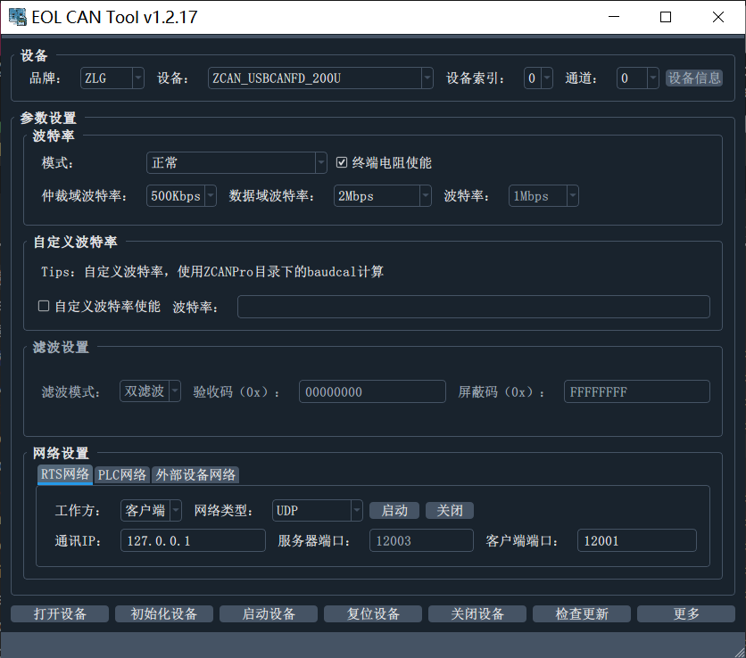
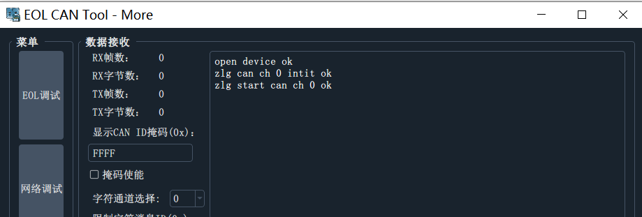
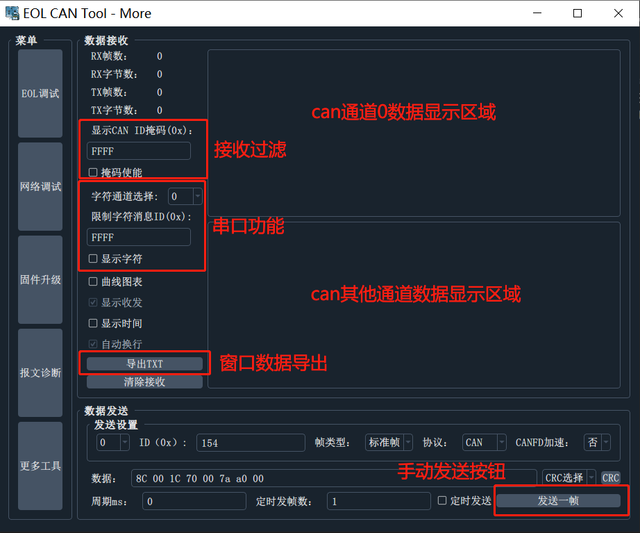
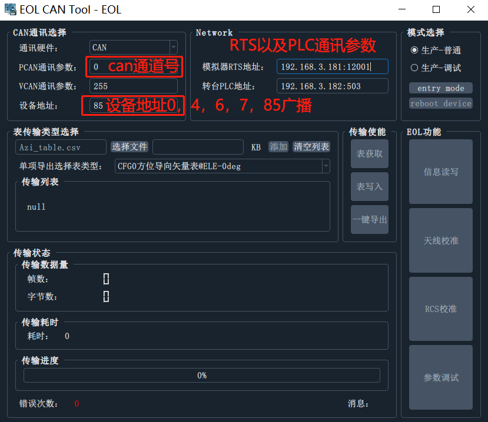
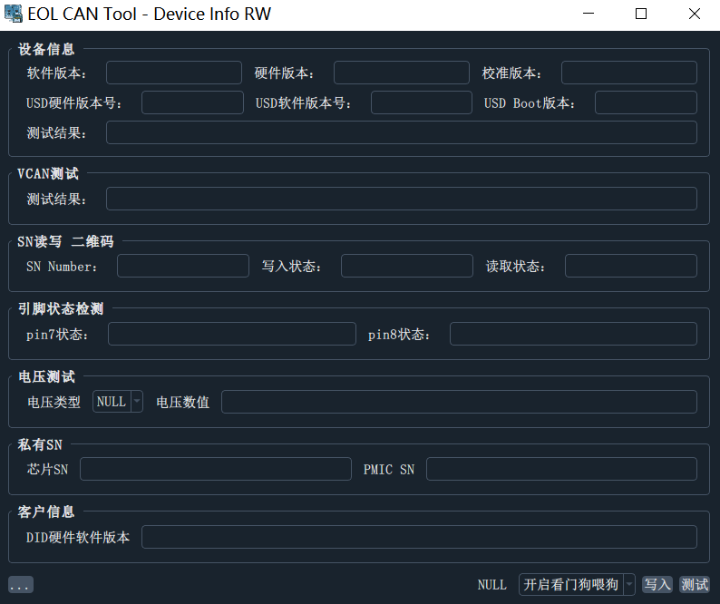
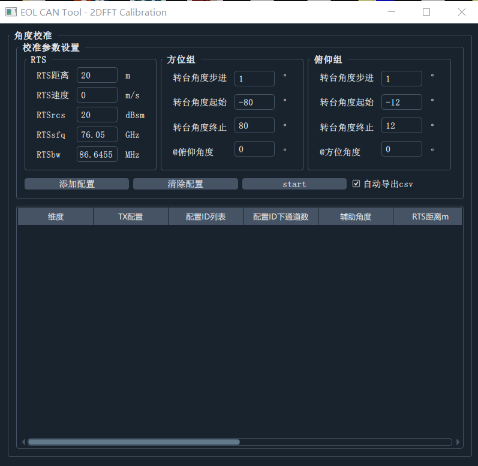
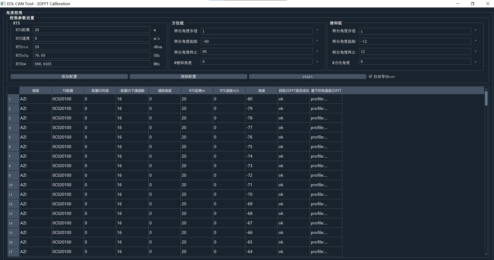
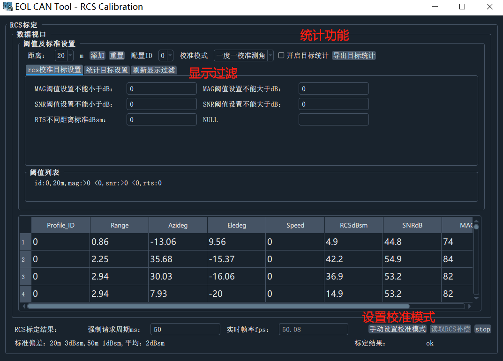

# EOL上位机功能

## 上位机功能

- 多品牌厂商can设备支持
  - 周立功全系
  - 广成 can / canfd
  - 同星
  - kvaser全系

- CAN数据通讯测试
  - 报文转换（将指定CANID报文 CANFD->CAN 或是 CAN->CANFD）
  - 队列定时发送
  - 队列定次发送
  - 手动发送
  - 报文周期监控统计
- CAN串口调试功能
  - 将串口数据转为ascii形式显示，与串口工具类似
- RTS控制功能（UDP网络）
  - 设置中心频率
  - 设置带宽
  - 设置距离
  - 设置速度
  - 设置rcs
- PLC控制功能（Modbus TCP），即将支持....
- shell交互功能
  - 查看软件版本、SN
  - 设置/读取雷达内部运行参数
  - 雷达重启
  - 查看方向图
  - 依据雷达软件任意扩展功能，等等...
- EOL全功能
  - 获取2D数据
  - 目标刷新显示
  - DBF校准数据写入读取
  - 雷达版本SN信息读写
- 网络调试功能
  - UDP
  - TCP
- 曲线图表功能
  - 支持来自can / 网络 / 串口数据的曲线绘制（用于程序运行时间监控、变量数值监控）
- 软件更新

## 上位机界面

## 使用说明

### CAN设备连接

#### 选择设备

can设备连接好电脑后，依次选择`品牌`->`设备型号`->`通道`（选择打开第几个通道或者全部打开，编号从0开始）

**设备索引**是用于区分，多个同型号can设备连接到电脑

**设备信息**是用于读取设备的SN，通道数等信息，当可读时点击将弹窗显示

#### 设置通讯参数

#### 启动连接

依次点击：打开，初始化，启动

> 点击 更多则进入can通讯测试主页面，上方窗口将显示，设备是否打开启动成功

### CAN通讯测试

本页的功能：

- 支持两个以上通道数据的收发
- 支持掩码配置
- 支持将接收的数据转为字符串输出（可指定需转换can通道，指定需转换的canid）
- 手动发送报文
- 报文收发双色显示，带时间戳
- 提供进入其他菜单的按钮
- 手动发送窗口能够自动在数值尾部添加计算常用的crc值，点击一下相应的crc按钮，自动计算数据crc数值，追加在数据尾部显示

- 支持定时发送、定次发送

- 曲线图表功能，勾选可将数据转发至图表曲线显示

### EOL调试页面

本页的功能：

- 提供进入或者退出EOL模式的按钮，重启设备按钮
- 提供各种类型表的写入与读取，以及相应的进度显示
- 提供报文传输返回值显示
- 提供进入EOL模式后的信息读写测试页面、天线校准页面、rcs校准页面
- 进入下级页面的按钮

### 信息读写页面

本页功能：

- 实现版本、SN、mounID读写测试
- DTC检测
- VCAN测试

### 天线校准页面获取2D数据

本页功能：

- 设置目标模拟器rts的相关参数
- 设置转台水平转动相关参数
- 设置转台上下抬头相关参数
- 模拟发送转台信息给雷达，请求2DFFT数据
- 生成2DFFT数据csv

### RCS标定看目标

本页功能：

- 设定阈值
- 持续获取目标数据

### shell调试

- 支持调试协议的设定内容，并联动rts以及转台
- 支持modbusTCP协议控制转台
- 支持TCP/IP协议控制RTS

## 更新功能

